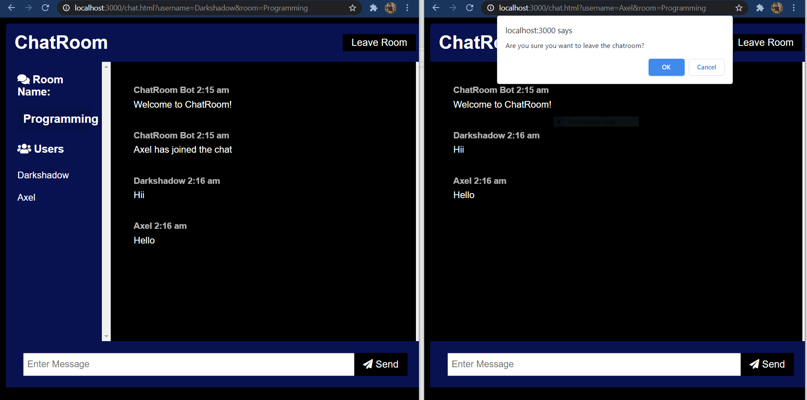

# CHATROOM
## First Look


## About
```
1. This is a place where one person can chat with other person in a common room.
2. Notify when other joins the room.
3. Notify when other leaves the room.
5. It is responsive. 
```
## Tech and FrameWork used
```
1. HTML
2. CSS
3. Javascript
4. Bootstrap
5. Nodejs
6. Express js
7. Socket.io
8. Moment.js

```
## User Login
Here just enter username and room you want to join.


## Enter in the room


## Chat
Here you can chat in a room with others.


## Leaving



## Left the Chat


## How to start
```
1. Run command node server.js in terminal.
2. http://localhost:3000 is the url.
  
```